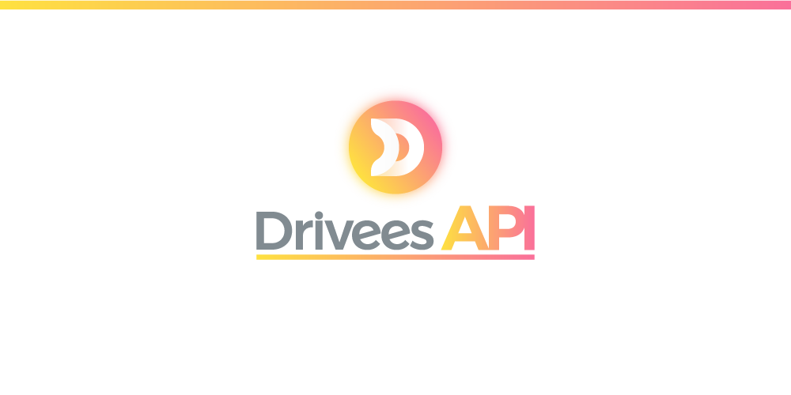

-----

This Repo. is for developing the API for the project.

## To start working on the project:
1. Install [VSCode](https://code.visualstudio.com/) and his plugins which are:
   1. Prettier
   2. ESLint
3. Install and configure PostgreSQL.
4. Open VSCode settings and make `"editor.formatOnSave": true`
5. Clone the project `git clone git@github.com:ialhamad/DriveesAPI.git`.
6. run `yarn install`
7. run `yarn .` (this is just for running the project, you don't need it now)
